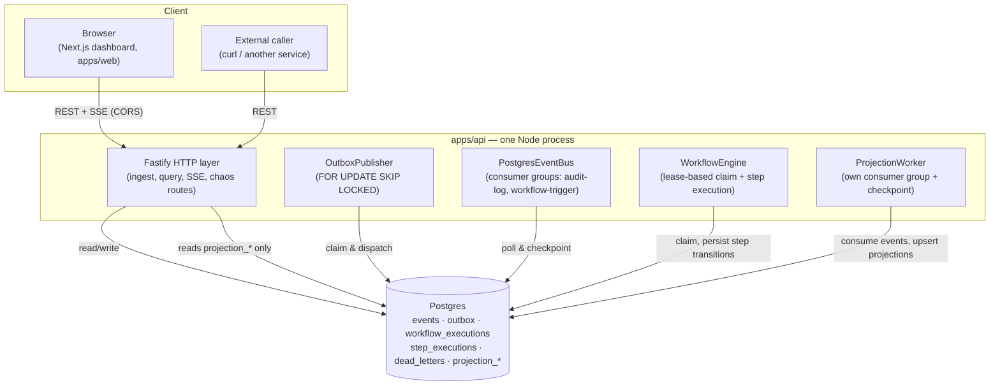

# Container Diagram — V1 (as built)

This reflects what actually runs, not the target architecture in the
original brief. No Kafka, no Redis, no separate worker processes — one
Postgres, one API process (four in-process workers), one Next.js app.

## What's deliberately absent

- **Kafka / Redpanda** — Postgres carries the event-bus role in V1
  (ADR-002). The `EventBus` interface is the seam for a V2 swap.
- **Redis** — no caching or distributed-lock need has been measured yet;
  see ADR-010 (not yet written) for when it would be justified.
- **A separate worker process** — `RUN_WORKERS` toggles the four
  in-process workers without a code change, but nothing has forced
  splitting them out yet (ADR-001).
