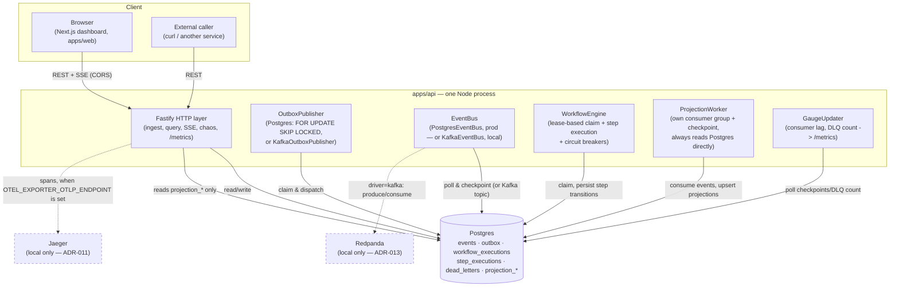

# Container Diagram — V1 + V2 (as built)

This reflects what actually runs — in production, and locally with the
optional V2 profiles enabled. No Redis, no separate worker processes:
one Postgres, one API process (five in-process workers), one Next.js
app. Kafka and Jaeger exist, are real, and are **local-only by design**
(ADR-011, ADR-013) — dashed in the diagram below, not because they're
stubs, but because production deliberately doesn't run them.

## What's deliberately absent everywhere, including locally

- **Redis** — no caching or distributed-lock need has been measured;
  see [ADR-010](../adr/ADR-010-redis-usage.md) for each candidate use
  case and why it already has a better answer.
- **A separate worker process** — `RUN_WORKERS` toggles the five
  in-process workers without a code change, but nothing has forced
  splitting them out yet ([ADR-001](../adr/ADR-001-modular-monolith-first.md)).

## What's real but local-only, and why

- **Kafka (Redpanda)** — a complete second `EventBus` implementation,
  built and load-tested against the Postgres one
  ([ADR-013](../adr/ADR-013-kafka-migration.md)). Comparable throughput
  at this project's scale didn't buy back the operational cost of a
  second piece of infrastructure, so production stays on Postgres
  (ADR-002's original decision, now backed by a measurement instead of
  an assumption). `docker compose --profile kafka up -d redpanda`.
- **Jaeger** — real OpenTelemetry tracing, verified end-to-end (one
  trace ID, 22 spans, across every async boundary in the system —
  [ADR-011](../adr/ADR-011-observability.md)). The production VM has
  ~1GB RAM total; there's no headroom to also run a trace backend next
  to Postgres, the API, and the dashboard. `otel/register.mjs` no-ops
  completely when `OTEL_EXPORTER_OTLP_ENDPOINT` is unset — zero runtime
  cost in production, not a disabled-but-present one.
  `docker compose --profile observability up -d jaeger`.
