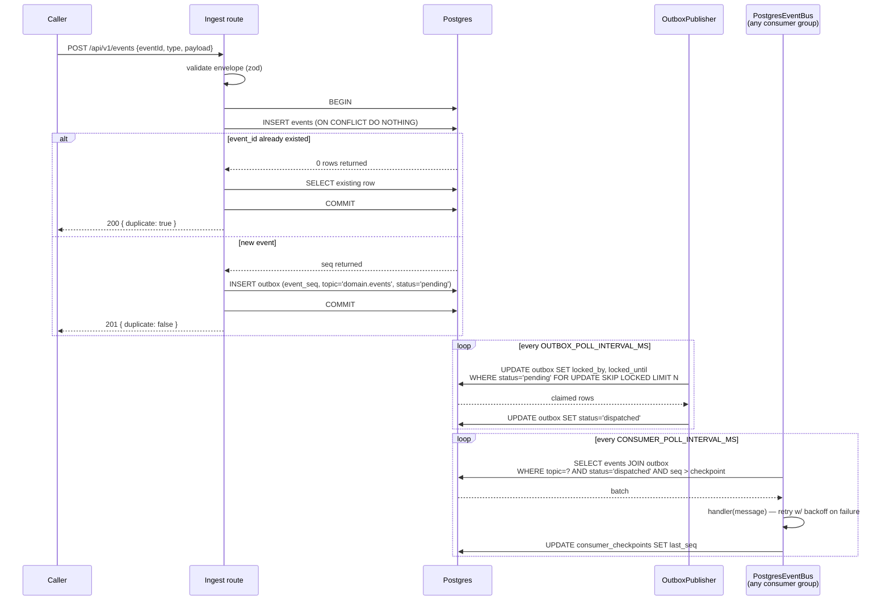

# Command & Outbox Flow

Traces one `POST /api/v1/events` from request to a downstream consumer
seeing it — the exact path ADR-003 (transactional outbox) exists to make
safe.

## Why this shape, specifically

- The event row and the outbox row commit **together** — a crash between
  them is impossible, not just unlikely (ADR-003).
- `locked_until` is a lease, not a held transaction — a publisher that
  dies mid-batch releases its claim automatically (verified in Phase 02
  by `kill -9`-ing the live process mid-batch: 32 rows still `pending` at
  the moment of death, dispatched on the very next tick after restart).
- The checkpoint advances **after each message**, not per-batch — a crash
  mid-batch loses at most the in-flight message's progress, which is safe
  because every handler is required to be idempotent (ADR-005).
