# Saga Flow — Forward Execution and Compensation

The `order-fulfillment` workflow, showing both the happy path and the
compensation path an exhausted retry triggers. Matches
`apps/api/src/modules/workflow/order-fulfillment.ts` and the engine's
actual behavior, verified live in Phase 03.

```mermaid
flowchart TD
    Start(["order.created event"]) --> V["validate-order"]
    V -->|ok| R["reserve-inventory"]
    R -->|ok| P["charge-payment"]
    P -->|ok, retries exhausted?| P
    P -->|ok| S["create-shipment"]
    S -->|ok, retries exhausted?| S
    S -->|ok| N["notify-customer"]
    N --> Done(["completed"])

    P -->|all attempts failed| CompStart["begin compensation"]
    S -->|all attempts failed| CompStart

    CompStart --> CU1["compensate: create-shipment<br/>(skipped — never succeeded forward)"]
    CU1 --> CU2["compensate: charge-payment<br/>(refund)"]
    CU2 --> CU3["compensate: reserve-inventory<br/>(release)"]
    CU3 --> CU4["compensate: validate-order<br/>(no-op)"]
    CU4 --> CompDone(["compensated"])

    CU2 -.->|compensation itself exhausts retries| DLQ[("dead_letters")]
    DLQ -.-> Failed(["failed"])

    style CU1 stroke-dasharray: 5 5
    style Done fill:#1a3a2a
    style CompDone fill:#3a2a1a
    style Failed fill:#3a1a1a
```

## What this diagram encodes that a generic saga diagram wouldn't

- **`create-shipment` is shown skipped in compensation**, not undone —
  because it never succeeded forward. This is the exact case Phase 03
  verified via `step_executions`: the step failed all 3 attempts and was
  confirmed absent from the compensation timeline, not silently
  compensated anyway.
- **Compensation order is the exact reverse of forward completion**
  (`charge-payment` → `reserve-inventory` → `validate-order`), each with
  its own retry budget.
- **A compensation that itself exhausts retries** goes to `dead_letters`
  and the execution ends `failed`, not a false `compensated` — the
  orchestrator never reports success it can't back up with a completed
  compensation chain.

## Persisted state backing this diagram

Every arrow above is a row transition in `step_executions`
(`direction: forward | compensate`, `status: running | succeeded | failed`)
and a corresponding `workflow_executions.status` update — both are what
survive a crash and drive resumption, not any in-memory state.
