# CQRS Flow

```mermaid
flowchart LR
    subgraph Write["Command side"]
        Ingest["POST /api/v1/events"] --> Events[("events (log)")]
        Events --> Outbox[("outbox")]
    end

    Outbox --> Consumers{"3 independent<br/>consumer groups"}
    Consumers --> AuditG["audit-log"]
    Consumers --> TriggerG["workflow-trigger"]
    Consumers --> ProjG["projection-worker"]

    TriggerG --> WFEngine["WorkflowEngine"]
    WFEngine --> WFExec[("workflow_executions<br/>step_executions")]

    ProjG --> RM1[("projection_throughput_minute")]
    ProjG --> RM2[("projection_tenant_activity")]
    ProjG -. "also reads<br/>(documented exception,<br/>see ADR-006)" .-> WFExec
    ProjG --> RM3[("projection_workflow_summary")]

    subgraph Read["Query side"]
        Dashboard["GET /api/v1/dashboard/*<br/>+ SSE stream"]
    end

    RM1 --> Dashboard
    RM2 --> Dashboard
    RM3 --> Dashboard

    style Write fill:#1a2333
    style Read fill:#1a2e2b
```

## Consistency, stated as a number

Read models lag the write side by at most one consumer poll interval —
**250ms** by default (`CONSUMER_POLL_INTERVAL_MS`). Verified directly in
Phase 04: captured the SSE stream to a file while concurrently POSTing a
new event, and watched `event_count` tick from 189 to 190 inside that
window — not asserted, observed.

## The one exception, drawn explicitly

`projection-worker` reads `workflow_executions` directly for the workflow
summary projection (dotted line above) rather than purely from the event
log — because the workflow engine doesn't yet emit a per-step domain
event (ADR-006). Every other projection is fed only by `events`.
