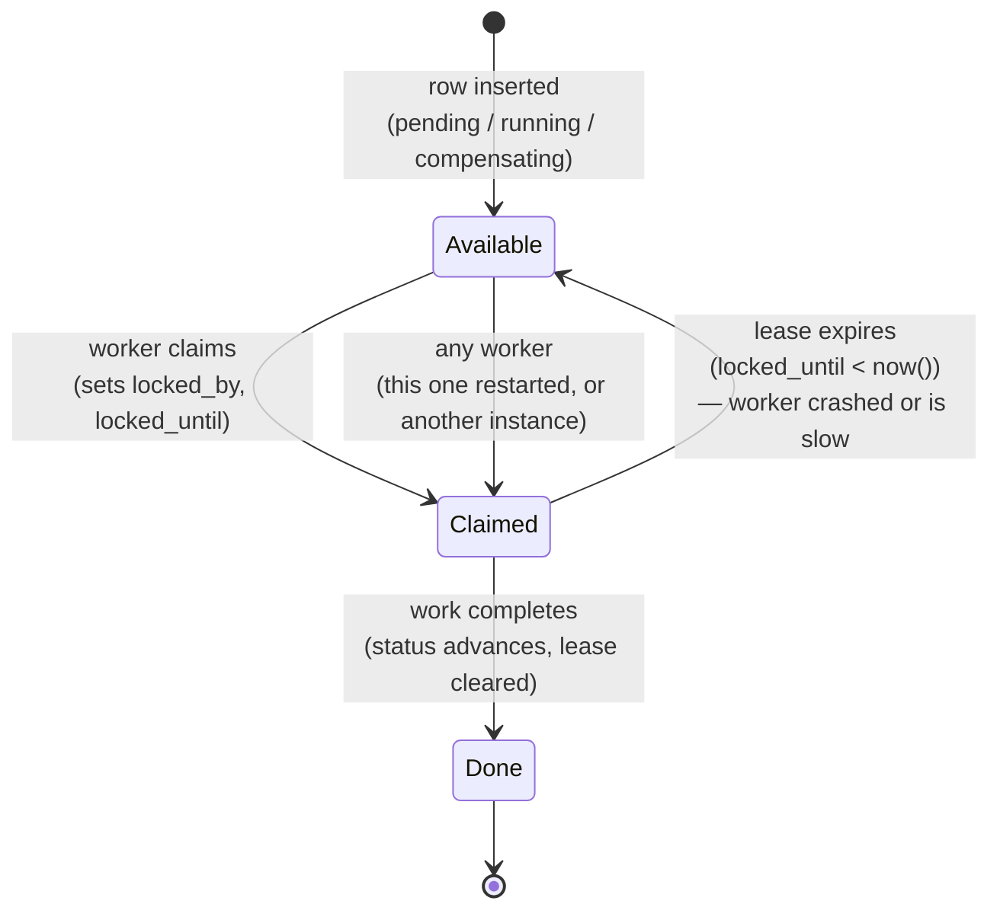

# Failure Recovery — One Pattern, Three Places

The outbox publisher, the event bus, and the workflow engine all recover
from a crash the same way: a **lease**, not a held transaction or
in-memory registry. This is the same diagram three times because it's
genuinely the same mechanism three times — worth drawing out explicitly
rather than leaving it implicit in three separate code files.

## Where this appears in the codebase

| Component | Table | Lease column | Verified by |
|---|---|---|---|
| `OutboxPublisher` | `outbox` | `locked_until` | Phase 02: killed mid-batch, 32 rows still `pending`, dispatched on next tick after restart |
| `PostgresEventBus` | (via `consumer_checkpoints`, no per-row lease — offset-based, like a Kafka consumer group) | — | Phase 02: same crash test, checkpoint resumed exactly where it left off |
| `WorkflowEngine` | `workflow_executions` | `locked_until` | Phase 03: killed before outbox ran even once (pre-dispatch crash) and after a full saga with fault injection — both resumed correctly |

## Why this matters architecturally

No component in this system has a separate "recovery mode" or startup
scan distinct from its normal operation. A restarted process runs the
exact same claim query it always runs; the lease's expiry is what makes
previously-claimed-but-abandoned work look identical to never-claimed
work. This is a smaller amount of code than a dedicated recovery path
would be, and — more importantly — it's continuously exercised by normal
operation instead of being a rarely-run code path that only executes
during an actual incident.
